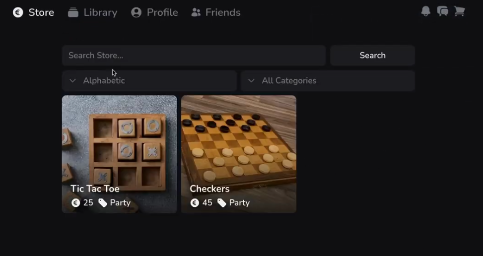
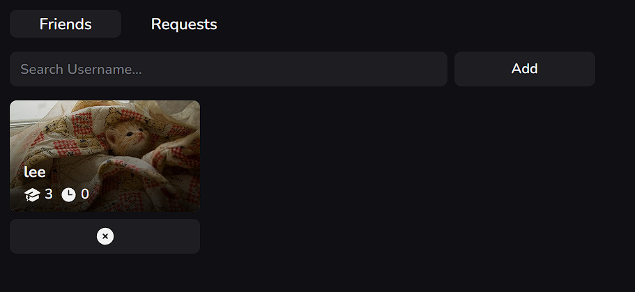
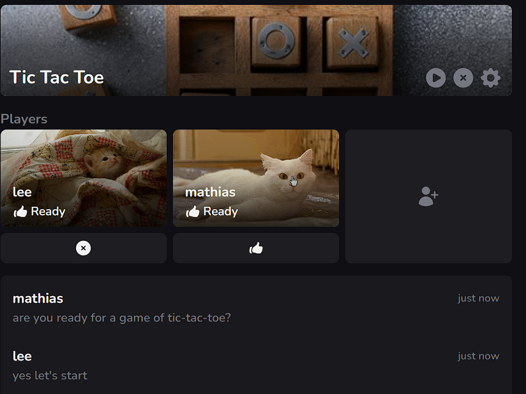

## One-line summary

Moko is a unified platform to buy, play, and socialize around digital board games — built as a DDD microservices project
during Integration Project 3.

---

## Team & contacts

I worked on Moko together with:

- Lee — https://leeco.dev/
- Kaj — https://niceduck.dev/
- Matti — teammate (backend)

Our DevOps contact for the environment and deployment setup was Kevin.

---

## What we set out to solve

Players today switch between store pages, chat apps, and game clients. We wanted a single place where users can:

- discover and purchase digital board games,
- play synchronously with friends or against an AI,
- keep a social profile, stats, and notifications without leaving the platform.

---

## Core features

- Store & Library: browse catalog, purchase, and manage owned games.
- Social: profiles, friend lists, and private conversations.
- Multiplayer: create lobbies, invite friends, play Tic Tac Toe, Checkers, and a Chess prototype (This works through a
  custom Anti-corruption layer).
- Real-time comms: lobby chat, in-game chat, and system notifications implemented over WebSockets through a gateway
  service.
- AI: chatbot integration to support users and AI opponents for single-player games.

---

## Architecture & technical choices

We chose a Domain-Driven Design + microservices approach so multiple teams could work independently, and it would be
easier to scale individual services later on.

Highlights:

- Bounded contexts per domain (store, library, profiles, lobby, games).
- Event-driven integration using RabbitMQ for eventual consistency.
- Identity and auth via Keycloak.
- WebSocket gateway to route real-time messages across services.
- Docker (and Kubernetes for deployment) for reproducible environments.

---

## Frontend approach

Built with React + Tailwind; state and data handled via Zustand and Axios. We followed a package-by-feature structure
and created a small component library from the start to keep the UI consistent.

Example tree (package-by-feature):

- src/app.tsx
- src/components/...
- src/features/...(cart, chat, checkout, friends, games, library, lobby, notifications, profiles, store)
- src/lib/...(api-client, socket-client, format, id helpers)

---

## Testing & local development

- ~90% coverage with unit and integration tests.
- Running all JVM services locally was resource heavy, so we prepared a Docker-based local dev environment to run most
  services without heavy IDE usage and use host.docker.internal for service communication.

---

## Lessons learned

- Microservices enabled parallel work across teams but introduced coordination overhead.
- Early design and conventions helped other teams integrate smoothly.
- Cross-team communication (AI/DevOps) is an area for improvement — having a named DevOps contact (Kevin) helped
  accelerate environment setup.
- Docker is essential for a multiservice development workflow.

---

---

## Demo & screenshots

### Demo video

<iframe width="100%" height="420" src="https://www.youtube-nocookie.com/embed/cTVb87V25zY" title="Moko Games demo" style="border: none;" allow="accelerometer; autoplay; clipboard-write; encrypted-media; gyroscope; picture-in-picture; web-share" allowfullscreen></iframe>

### Screenshots

  
  

