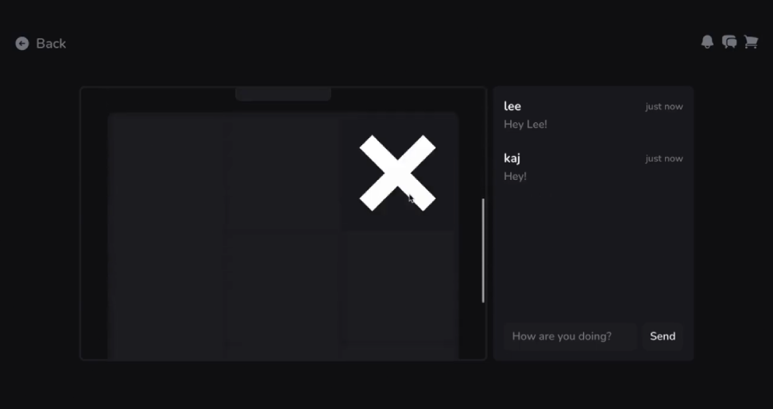

## About the project

This project was an assignment for the Integration Project 3 course. Students were divided based on their major (Developers, AI and Deployment / DevOps). This meant we had to collaborate with external teams for the first time during our bachelor's degree.

Our goal was to build a platform where users can buy digital board games, play together and build a community without having to switch between different services.

---

## Core Features

- Store & Library Management  
  - Browse and purchase (integration with a payment service) digital board games and manage your personal library.
- Social Features  
  - Profile management (achievements, favorites, statistics) and friend connections.
- Multiplayer Features  
  - Lobby creation and invitations + playing with friends or against an AI.
- Communication  
  - Chat with friends or with an AI for platform information + chat during lobby or game + notifications.
- Games  
  - Tic Tac Toe, Checkers and an external Chess prototype with a translation layer.

---

## Architecture

We chose a microservices architecture due to the complexity and scale of Moko. Benefits:
- Independent development (parallel teams).
- Scalability (horizontal scaling for specific services).
- Clear domain boundaries and loose coupling via events.

We created a detailed plan of the different microservices and their communication patterns. All real-time features (Lobby, Chat and Notifications) are implemented with WebSockets instead of polling. For this we used a gateway service that routes messages through the platform.

---

## Frontend

The frontend is written in React with Tailwind, Zustand and Axios. We started with designs in Figma and then built component-driven. Key principles:
- User-centric navigation
- Consistent design and visual language
- Responsive and modern design

Project structure (package-by-feature) and a custom component library. Data fetching and UI state are separated per service.

Example folder structure:
- src/app.tsx
- src/components/...
- src/features/... (cart, chat, checkout, friends, games, library, lobby, notifications, profiles, store)
- src/lib (api-client, socket-client, etc.)

---

## Testing and Local Development

We achieved ~90% test coverage with unit and integration tests. Local development with all microservices was resource-intensive (many JVMs/IDEs). Solution: a local Docker environment for development where almost all backend services could run via host.docker.internal — significantly less memory usage than running all services in IDEs.

---

## Conclusion

- Microservices were the right choice for this project.
- Early specification of the design gave an advantage for backend and frontend.
- Communication with external teams (AI, DevOps) can still improve.
- Docker is essential for such architectures.
- Tutors appreciated the neat code conventions, architecture decisions and clean code.

---

## Pssst

When a user creates a new profile, they automatically receive a random profile picture from an external API. Click here for more information.

---

## Showcase

Demo video:

- https://youtu.be/cTVb87V25zY

Screenshots:

### Store

### Friends

### Tic Tac Toe

